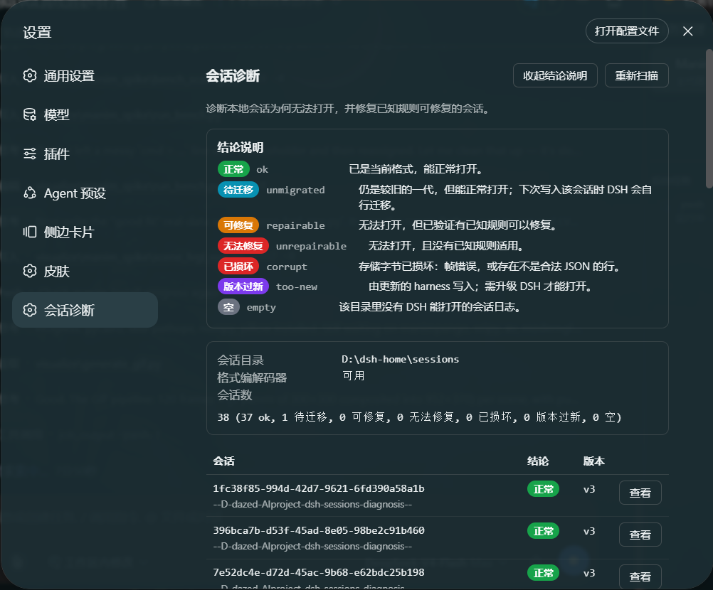
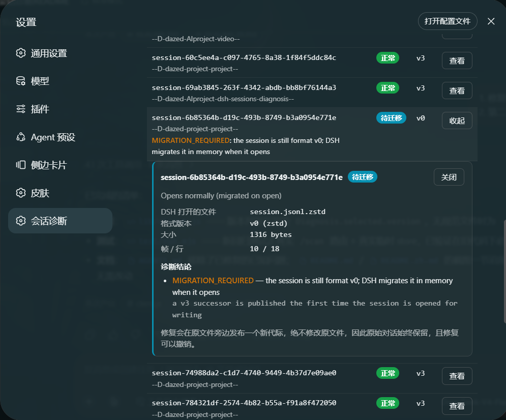

# dsh-sessions-diagnosis

**诊断并修复 DSH 升级后打不开的会话 —— 支持命令行、Agent 工具、以及 DSH Web 界面中的可视化面板。**

[English](README.md) · [根因分析](docs/ROOT-CAUSE.zh-CN.md) · [Root cause (English)](docs/ROOT-CAUSE.md)

---

## 问题是什么

DSH 把每个会话存成一个目录，里面**每种格式代际一个不可变文件**，并在打开时惰性迁移旧文件。
从 0.1.5 起，迁移的最后一步是一次**封闭词表审计**：每条消息的 `source.kind` 必须属于固定的
15 个取值，否则**整个迁移直接中止**。

只要有一条已废弃的取值，这个会话就再也打不开了。实际遇到的元凶是 `at-file-mention` ——
旧版本在用户输入 `@路径` 时生成的那条合成用户消息所带的来源标记。所以故障看起来毫无规律：
**只影响那些曾经用过 `@` 的会话**。

会话仍然**出现在列表里**（列表只读文件头），但打开时报一个笼统的 `gateway/internal` 错误，
完全不提原因。而迁移失败时**什么都不会写盘**，所以磁盘上也没有痕迹可查。

→ [**完整根因分析**](docs/ROOT-CAUSE.zh-CN.md)

## 这个插件做什么

| | |
|---|---|
| **诊断** | 直接运行 DSH **自己**的正式迁移链，报告的原因就是 DSH 实际遇到的原因 —— 不是重新实现，也不是猜测。把每个会话分类为 `ok` / `unmigrated` / `repairable` / `unrepairable` / `corrupt` / `too-new` / `empty` / `unknown`（什么都没检查：这份 DSH 没有可用的编解码器），并定位到具体字段 —— [每个结论的含义](docs/ROOT-CAUSE.zh-CN.md#失败分类)。 |
| **修复** | 生成一个合法的当前格式后继文件，让 DSH 自己去选它。**写入前先验证**，且**从不修改原文件**。 |
| **可视化** | DSH Web 界面中的面板：列出每个会话的结论与原因，支持一键修复，并带 dry-run 确认步骤。 |

## 界面截图

**可视化面板 —— 设置 → 会话诊断。** 列出每个会话的结论和结论背后的原因，每行一个**查看**按钮；
修复在动手之前，总会先把计划修改展示给你。



**单个会话的详情**，就在它自己那一行下方展开：DSH 打开的文件、结论背后的诊断条目，
以及修复给出的保证。



## 安装

在检出目录里执行即可。`.` 不需要绝对路径：`dsh` 会把相对路径重写到**你运行它的目录**
（pnpm 本身是在 profile 目录里跑的，在那里 `.` 会变成 profile 自己）。

```bash
git clone https://github.com/YouHui1/dsh-sessions-diagnosis.git
cd dsh-sessions-diagnosis
dsh plugin --profile web add .
```

`dsh` 会识别 `dsh.bundle.patch`，把包链接进 profile，并把 `dsh-sessions-diagnosis`
追加到 `dsh.profile.bundles`。依赖记录为 `link:<你的检出目录>`，也就是 profile 直接读取
你克隆下来的代码 —— 更新只需拉取并重启，不用重新安装。之后**重启 DSH** 并强制刷新浏览器。
面板位于**设置 → 会话诊断**。

不想在本地保留检出目录，也可以直接从 GitHub 安装：

```bash
dsh plugin --profile web add github:YouHui1/dsh-sessions-diagnosis
```

这种方式拿到的是副本而非链接，后续更新用
`dsh plugin --profile web update dsh-sessions-diagnosis`。

两种方式都**无需构建、无需安装依赖**：插件直接提供编译好的 JavaScript，并在运行时定位 DSH 自己的格式编解码器。

> **修复会话本身不需要重启** —— DSH 在打开时才解析代际，所以修复后下一次点击就能打开。

## 使用方式

### 命令行

命令行工具就是仓库里的一个脚本，**无需安装，直接在检出目录里运行**：

```bash
node bin/dsh-session-doctor.mjs scan
```

**下面的示例为了简洁省略了 `node bin/` 前缀** —— 把 `dsh-session-doctor scan`
读作 `node bin/dsh-session-doctor.mjs scan`。如果想直接敲短命令，在仓库根目录执行一次
`npm link`（会写入你的 npm 全局目录），之后 `dsh-session-doctor` 就和 `dsh` 一样在 `PATH` 上了。

```bash
dsh-session-doctor scan                    # 查看会话目录概况
dsh-session-doctor diagnose                # 分类所有会话
dsh-session-doctor diagnose <id>           # 详细诊断单个会话
dsh-session-doctor repair <id>             # 试运行 —— 不写任何文件
dsh-session-doctor repair <id> --apply     # 真正执行修复
dsh-session-doctor repair --all --apply    # 修复所有可修复的会话
dsh-session-doctor rollback <id>           # 撤销本工具做过的修复
dsh-session-doctor verify                  # 用 DSH 的编解码器验证全部会话
dsh-session-doctor demo                    # 生成一个合成的坏会话用于练习
dsh-session-doctor demo --remove --apply   # 再把它删掉
dsh-session-doctor rules                   # 列出修复规则
```

任意命令都可加 `--json` 输出机器可读结果；`--dsh-home <path>` 可指向非默认的会话目录。

### 不拿真实数据冒险，先试一遍

```bash
dsh-session-doctor demo                          # 已废弃的 source.kind（低风险规则）
dsh-session-doctor demo --scenario descriptor    # 过期的 descriptor 版本（中风险规则）
dsh-session-doctor demo --cwd D:\my\project      # 指定记录的工作目录
dsh-session-doctor demo --id my-demo-session     # 指定会话 id
```

这会写入一个**合成**的坏会话 —— **不涉及任何真实对话**。它是一个货真价实的 v0 格式日志，
所以 DSH 拒绝它的原因和拒绝真实会话的原因完全一样，修复规则也完全一样。

**演示会话绝不会进入你的会话库。** 它本身就是一个注定读不开的会话：放进 DSH 真正读取的目录，
就等于把一个坏会话摆在你自己的对话旁边、往侧边栏里塞一行本不该出现的记录，
还会让演示会话的 id 变成 harness 持久状态的一部分。所以 `demo` 只写入它自己的一次性会话库 ——
默认在 `<tmp>/dsh-session-doctor-demo`，可用 `DSH_DEMO_HOME` 改位置 —— 并且
**拒绝 `--root` 指向真实会话库**，无论用哪种写法绕过来：

```text
refusing to create a demo in the real session store (C:\Users\you\.dsh\sessions).
A demo is a deliberately broken session; it must not join your conversations.
```

这个演示库本身就是一个完整的 DSH home，所以整套流程可以完全照着真实会话库跑一遍：

```bash
dsh-session-doctor demo                                  # 创建
dsh-session-doctor diagnose <id> --root <演示库>          # 确认它读不开
dsh-session-doctor repair   <id> --root <演示库> --apply  # 修复
dsh-session-doctor rollback <id> --root <演示库>          # 撤销
dsh-session-doctor demo --remove --apply                  # 删掉
```

想在面板里看同样的流程，就把一个**临时** harness 指向那个 home —— 绝不是你现在正在用的这个：

```powershell
$env:DSH_HOME = "<tmp>/dsh-session-doctor-demo"; dsh web
```

清理有两道防护，因为演示会话一旦存在，就是一个普通会话：

- **归属靠证明，而不是靠猜。** 演示会话带有只有本工具才会写入的
  `session.diag-demo.json` 标记，且标记必须指向它所在的那个目录。**永远不信任会话 id** ——
  id 只是一个字符串，真实对话完全可能碰巧长得像演示 id。这类会话对清理命令是**不可见**的。
- **你聊过的演示会话会被保留。** 标记里记录了生成时的确切字节，所以清理能区分「原封不动的演示」
  和「已经被续写过的演示」。凡是含有本工具没写过的内容，都会被报告并跳过，除非你显式传 `--force`。

早期版本的演示会话确实写进过真实会话库；如果你在侧边栏归档过它，那个 id 会留在
workspace 注册表里。这种残留是无害的 —— 过期 id 匹配不到任何东西，本工具也不会去改那个文件 ——
而且 `demo --remove` 仍能清理留在那些库里的演示会话。新的演示会话不会再写进去了。

### Agent 工具

为模型注册了三个工具：

- `session_store_overview` —— 轻量普查（只读文件头）
- `session_diagnose` —— 完整分类，可全库或单会话
- `session_repair` —— **默认试运行**，只有传 `apply: true` 才写入；
  传 `action: "rollback"` 可撤销它自己做过的修复

### 可视化面板

**设置 → 会话诊断。** 可扫描、查看结论与具体的计划修改，并执行修复 ——
修复按钮总是先跑一次 dry run，把将要修改的内容展示给你，然后才动手。
**结论说明** 会在面板里解释全部七种结论，每个徽章也带着同一句说明作为悬浮提示，
所以看到「待迁移」这类标签时，不必翻文档就能明白。
被本插件修复过的会话会显示修复记录和**撤销本次修复**按钮。
点**查看**后，该会话的详情就在它自己那一行下方展开（再点一次收起），
所以在长列表底部点击也不必滚回顶部。

## 安全模型

以下每一条都由测试套件实际断言，而不只是设计意图。

### 原始数据绝不被修改

默认策略在**原文件旁边发布一个新代际**，原文件逐字节保持不变 —— 这正是 DSH 自己的
增量发布方式。通过对比修复前后源文件的 SHA-256 来验证，在真实会话和测试中都是如此。

### 对话内容可证明地得到保留

结构合法 ≠ 内容保留：迁移完全可能产出一个能正常读取、却悄悄丢了消息的日志。
因此每次修复都会从源日志中提取**每一条消息负载**，并要求它们全部出现在结果里。
允许新增（v2→v3 规范本身就会插入一个空 system 头，并把记录的提示词从请求头提升为消息），
但**一旦发现丢失或改写，就会在写入任何东西之前中止修复**。该结果会写进每次修复的返回值。

### 未经两轮验证，绝不写入

1. 修补后的日志会用 DSH **真实**的 v0→v3 链跑一遍迁移；
2. 结果用 **DSH 自己的**当前格式编码器编码；
3. 再把字节读回来，必须同时通过存储层的结构准入检查**和两种校验策略下的完整还原**；
4. 源日志的每一条消息负载都必须存活。

任何一步失败，都不会产生任何文件。

### 失败是原子的

发布会先落一个完整文件，再硬链接到位，因此读者要么看到完整的代际，要么什么都看不到。
在不支持硬链接的文件系统上，排他复制的回退路径也会被校验，**一旦不匹配就立刻删除** ——
一个写了一半的代际比没有代际更糟，因为 DSH 会优先选它而不是那个还能读的旧代际。

### 修复可逆

每次修复都会在旁路文件（`session.diag-repair.json`，DSH 会忽略它）里记录做过什么，
其中包含两个文件的 SHA-256。`rollback` 于是：

- 把已发布的代际**移到一旁**（绝不删除）；
- 如果该文件在修复之后发生过变化，就**拒绝撤销** —— 因为一旦你继续使用该会话，
  DSH 会往当前代际追加内容，此时撤销会丢掉之后写入的全部内容。

### `patch-source` 是谨慎的兜底方案

仅用于无法访问 DSH 编解码器的环境。它会在**触碰原文件之前**先验证备份副本逐字节一致，
确认原文件在被读取之后没有变化，然后通过暂存文件加改名来替换，
而不是就地截断原文件。

> 唯一无法撤销的，是你自己删掉的会话。本工具从不删除任何会话日志。

另见[陷阱 2](docs/ROOT-CAUSE.zh-CN.md#2-绝不要承诺一个你尚未证明的修复)。

## 修复规则

| 规则 | 风险 | 修复内容 |
|---|---|---|
| `unclassified-message-source` | 低 | 把已废弃的 `source.kind`（如 `at-file-mention`）改写为 `user`。`@` 引用的路径不会丢失 —— 它本来就存在于消息内容里。 |
| `subagent-descriptor-version` | 中 | 把过期的 `subagent/descriptor.data.version` 修正为正式编解码器要求的 `3`。 |

修复会运行**所有匹配的规则**，因此被诊断为「可修复」的会话一定可以修复，结果中也会报告实际
运行了哪些风险等级。风险标签是一种**告知**，而不是隐藏的门槛：dry run 加上显式的 `apply`
才是同意步骤。

唯一的例外是**批量操作**：`repair --all` 默认只跑低风险规则，除非传 `--include-medium-risk` ——
因为批量场景下没有逐会话的 dry run 可供查看。它会**列出**被跳过的会话，而不是静默略过。

<details>
<summary><b>如何新增规则</b></summary>

规则是数据，不是代码路径：在 `lib/core/rules.js` 里加一项即可。

```js
{
  id: 'my-rule',
  title: '一句话描述修复内容',
  risk: 'low',                       // 'low' 默认启用，'medium' 需显式指定
  rationale: '用文字说明这个修改为什么正确。',
  detect (rows) {                    // -> Finding[]
    return rows.filter(...).map((row) => ({
      ruleId: 'my-rule', seq: row.seq, type: row.type,
      path: 'data.someField', before: ..., after: ...,
      detail: '展示给用户'
    }))
  },
  apply (rows, findings) {           // 就地修改 rows，返回修改条数
    ...
  }
}
```

其余工作由框架完成：结果以修改前后对照的形式展示，修复在提供之前会先被模拟，
每次写入都会经过验证。记得在 `test/run.mjs` 里加测试。
</details>

## 工作原理

```
lib/core/
  frames.js     拼接式 Zstandard 帧容器（扫描 / 解码 / 编码）
  store.js      定位 DSH_HOME、枚举代际、来源类型词表
  format.js     运行时定位 DSH 的格式目录；执行它真实的迁移
  rules.js      修复规则目录
  diagnose.js   静态审计 + 实时迁移探测 + 修复模拟
  repair.js     计划、验证、发布
lib/index.js    宿主半边：Agent 工具 + 面板 JSON API
lib/client.js   浏览器半边：可视化面板
bin/            独立命令行工具
```

核心是**不引用 DSH 任何模块**的纯 Node.js 代码 —— DSH 的编解码器在运行时被定位并动态导入 ——
因此插件、命令行和测试共用同一份实现。

拼接容器通过**按帧头与块头结构化遍历**来解码，而不是直接解压：因为
`zstdDecompressSync()` 在遇到拼接容器的第一个帧之后就会停止。

## 注意事项：DSH 的 JSON Schema 子集在启动时强制校验

如果你要基于本插件扩展工具，请注意 `ctx.tools.register()` 会**在 profile 启动过程中**
立刻校验你的 `output.schema`。不符合 DSH 支持子集的 schema 不会优雅降级，而是直接抛错、
导致 loader 条目失败、`dsh web` 拒绝启动：

```
Error: dsh: plugin tree failed to load: failed to apply loader entry <id> ...
unsupported JSON schema: schema.properties.<x>.additionalProperties is not supported on type "array"
```

支持的子集：单个标量 `type`、`properties` / `required` / 布尔 `additionalProperties`
（**仅限 object**）、`items`（**仅限 array**）、标量 `enum` / `const`、以及恰好一个分支的
`oneOf`。位置错误的关字会被拒绝，而不是被忽略。

`test/run.mjs` 通过运行 DSH 自己的 `assertSupportedJsonSchema` 与
`validateJsonSchemaValue`（覆盖每个定义和工具实际返回的每个值），以及把插件挂载到真实的
`cordis` Context 与 `ToolRuntime` 上来防止这个问题回归 —— 那正是启动时失败的那一次调用。

## 环境要求

- Node.js **≥ 22.15**（需要内置 `node:zlib` 的 Zstandard 支持）
- 插件的两个半边需要 DSH 0.1.5-rc.2；命令行工具需要一个会话目录，
  并（为了最强诊断能力）需要一个可借用格式编解码器的 DSH 安装
- 命令行工具在更旧的 DSH 上也能跑：若没有 `@deepseek-ai/dsh-session-format-catalog`
  （0.1.3-alpha.2 起才有），它会把旧日志报为 `unknown`，而不是去猜

## 测试

```bash
node test/fetch-fixtures.mjs   # 从你自己的会话目录里取一个损坏的代际作为样本（可选）
node test/run.mjs
```

测试覆盖帧容器、代际命名、规则引擎、诊断结论，以及完整的修复链路。
依赖真实会话的测试会从 `.scratch/` 读取样本，样本不存在时**自动跳过**，
因此在干净的检出中也能运行。

> 样本是你某次对话的逐字副本。`.scratch/` 已被 git 忽略 —— 请不要提交它，也不要把它附到 issue 里。

## 许可证

MIT
